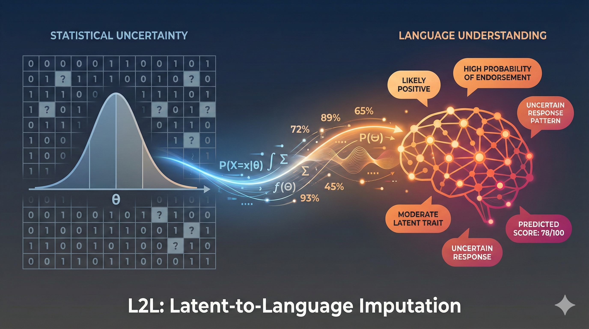

# Latent-to-Language (L2L) Framework

**Can Psychometric-Informed Prompts Improve LLM-Based Survey Item Imputation?**

Kevin Linares \| Joint Program in Survey Methodology, University of Maryland



## Overview

The L2L framework translates psychometric model *conclusions* — not raw parameters — into natural language prompts for Large Language Models, enabling psychometrically-informed imputation of missing survey item responses within a Total Survey Error framework.

The core innovation is the **model-then-adjust paradigm**: the IRT or CFA model provides a starting-point prediction for each masked item, and the LLM refines it using information the statistical model cannot capture — within-respondent consistency (residual patterns), correlated-item signals, demographic probability context, and domain knowledge about institutional trust. Prompts communicate model conclusions (predictions, confidence levels, adjustment directions) rather than raw psychometric parameters (discrimination values, thresholds, factor loadings), because LLMs are reasoners, not calculators.

Using two nationally representative surveys — **LAPOP Mexico 2023** (N = 1,430; 12-item institutional trust scale, 7-point) and **Latinobarómetro Colombia 2023** (N = 1,073; 6-item institutional distrust scale, 4-point) — we compare four imputation methods (two tree-based benchmarks, two LLMs) across three information tiers in a **5-fold cross-validation** experiment with per-fold CFA refitting, IRT/GRM estimation, demographic profiling, and m=5 multiple imputation replication.

## Key Findings

-   **Psychometric context improves item recovery monotonically**: Claude Sonnet weighted kappa from .645 (S) → .667 (P1) → .675 (P2) on LAPOP; .550 → .559 → .579 on Latinobarómetro
-   **LLMs outperform traditional methods at the fair comparison (S tier)**: Claude Sonnet (.645 LAPOP, .550 LB) vs. mixgb (.615, .463) and miceRanger (.561, .504)
-   **All methods preserve construct ordering**: r \> .983 with ground truth θ on LAPOP; Claude achieves r = .930 on LB vs. mixgb .895
-   **Imputation error is overwhelmingly random**: Systematic bias accounts for less than 1% of total MSE for Claude Sonnet, less than 3% for mixgb (Biemer decomposition)
-   **Psychometric context reduces centripetal compression**: Compression slope moves from −0.464 (S) to −0.363 (P2) on LAPOP; Claude P2 compresses less than mixgb S on both surveys
-   **Prior-attitude interference**: Items where LLM world-knowledge priors conflict with population attitudes (armed_forces) show systematic directional bias — a processing error mechanism unique to LLM-based imputation

## Research Questions

1.  **RQ1 — Psychometric Context Utilization**: To what extent does communicating progressively richer psychometric model information improve LLM-based item imputation and under what conditions (e.g., LLM architecture)?
2.  **RQ2 — Construct-Level Recovery**: How closely do imputed data preserve respondents' positions on the latent construct, as measured by the correlation and regression slope between ground truth and imputed θ estimates?
3.  **RQ3 — Measurement Error Structure**: What is the structure of the measurement error that imputation introduces at the item level through psychometric context engineering?

## Tier Design

### LLM Tiers

| Tier | Information | Paradigm |
|:-----------------|:-----------------------------|:-----------------------|
| **S** | Screened demographics + observed items (verbal labels) | World knowledge only |
| **P1** | S + CFA factor score (percentile) + CFA prediction anchor + 2 correlated items with CFA residuals | Model-then-adjust (CFA) |
| **P2** | S + IRT modal prediction with confidence + 2 correlated items with IRT residuals + demographic probability context P(high trust \| group) | Model-then-adjust (IRT) |

### Traditional Method Tiers

| Tier   | Features                                              |
|:-------|:------------------------------------------------------|
| **S**  | Screened demographics + observed items (masked as NA) |
| **P1** | S + CFA factor score (numeric column)                 |
| **P2** | S + IRT θ (numeric column)                            |

Note: Traditional methods at P1/P2 also see the complete training response matrix, giving them an information advantage over LLMs. The fair comparison is LLM tiers against traditional methods at S. Traditional P1/P2 results are reported in the appendix.

### Demographic Screening (Script 02)

Demographics screened using η² with both IRT theta and CFA factor score (threshold ≥ 0.005). Survivors per survey:

-   **LAPOP**: age_cat, Edu, Urban, Employment (male dropped)
-   **LB**: age_cat, Edu, Employment (male + Urban dropped)

## Repository Structure

```         
├── code/
│   ├── 01_data_preparation.qmd          # EFA/CFA, variable recoding, listwise deletion
│   ├── 02_kfold_cfa_irt.qmd             # 5-fold CV, CFA, IRT/GRM, demographic profiling,
│   │                                    #   masking table generation
│   ├── 03_traditional_item_imputation.R  # mixgb + miceRanger on S/P1/P2 tiers (m=5)
│   ├── 04_LLM_item_imputation.R         # LLM item imputation (model-then-adjust, m=5 MI,
│   │                                    #   graduated temperature, parallel batching)
│   ├── 05_item_results.qmd              # RQ evaluation, CFA/IRT visuals, TSE analysis
│   ├── item_prompt_functions.R           # Prompt construction + response parsing
│   ├── prompt_engineering.qmd            # Prompt design documentation + decision log
│   └── references.bib                    # Bibliography
│
├── results/                              # Generated by scripts (not tracked)
│   ├── survey_data.rds                   # Prepared data (list: lapop, lb)
│   ├── fold_data.RData                   # folds_list, cfa_list, irt_list, masking_tbl
│   ├── cfa_reporting.RData               # CFA/IRT params, demo_profile_tbl
│   ├── irt_models.RData                  # Fitted mirt model objects per fold
│   ├── results_trad_item.rds             # Traditional method results (S/P1/P2)
│   ├── results_item.rds                  # LLM majority-vote results (m=5)
│   ├── results_item_raw_runs.rds         # LLM per-run results (for MI variance)
│   ├── all_results_combined.rds          # Combined traditional + LLM results
│   └── evaluation_rq.RData              # Pre-computed RQ evaluation tables for manuscript
│
└── README.md
```

## Pipeline

```         
Script 01 (Data Preparation)
    │
    ▼
Script 02 (5-Fold CV + Psychometric Infrastructure)
    │   CFA, IRT/GRM, demographic profiling (η² screening,
    │   group means, model-based probabilities), masking table
    │
    ├──────────────────────────┐
    ▼                          ▼
Script 03 (Traditional)    Script 04 (LLM Imputation)
  mixgb + miceRanger         Claude Sonnet, Maverick
  S / P1 / P2 tiers          S / P1 / P2 tiers
  m=5, majority vote          m=5 MI (temp 0.01–0.40), majority vote
  Screened demographics       Model-then-adjust paradigm
    │                          │
    └──────────┬───────────────┘
               ▼
         Script 05 (Results)
           RQ1: Weighted kappa, accuracy by tier
           RQ2: θ correlation, regression slope
           RQ3: Biemer decomposition, compression slope
           Signed error heatmaps, per-item analysis
```

## Prompt Design (V2)

The prompt architecture communicates model **conclusions**, not parameters:

| What the model computes | What the LLM sees |
|:---------------------------------------|:-------------------------------|
| IRT modal category + probabilities | "Model prediction: 5. Confidence: MODERATE (5 at 35%, 4 at 22%)" |
| IRT residuals for observed items | "police = 6 (model expected 5.2, +0.8 above → suggests this item should also be ABOVE model)" |
| Mean residual across items | "This respondent consistently rates ABOVE the model (+0.5 avg) → adjust predictions UPWARD" |
| P(high trust \| demographic group) | "For your group, P(high trust on armed_forces) = 48% vs. population 43%" |

### What was dropped from V1

-   IRT discrimination/threshold tables
-   CFA standardized loadings
-   Q3 residual correlation matrices
-   Conditional expectations E[X_miss \| X_obs]
-   Chain-of-thought reasoning

### Psychometrician Persona

System prompt establishes a JPSM PhD survey psychometrician with expertise in institutional trust measurement. Key reasoning rules: residual pattern is the strongest signal; halo effects mean consistent respondents stay consistent; demographic context is a sanity check, not the primary signal.

## Multiple Imputation Design

LLM predictions are treated as m=5 multiple imputations with graduated temperature:

| Run | Temperature |
|-----|-------------|
| 1   | 0.01        |
| 2   | 0.10        |
| 3   | 0.20        |
| 4   | 0.30        |
| 5   | 0.40        |

Majority vote across 5 runs yields the final prediction, matching the m=5 majority-vote design used for traditional methods. Checkpointing per run enables resume after interruption.

## Models

| Model | Provider | Batch Size | Parallel | Role |
|:--------------|:--------------|:--------------|:--------------|:--------------|
| Claude Sonnet 4.6 | Anthropic API | 50 | 10 | Strongest LLM (production) |
| Llama 4 Maverick | OpenRouter | 25 | 2 | Second-tier LLM |
| mixgb | R package | — | — | Tree-based benchmark (XGBoost) |
| miceRanger | R package | — | — | Tree-based benchmark (Random forest) |

Gemma 3 27B was evaluated but dropped from the final analysis.

## Evaluation Framework

### RQ1 Metrics (Item-Level Recovery)

| Metric | Description |
|:---------------------------|:-------------------------------------------|
| Weighted kappa | Quadratic weighted kappa (primary); penalizes larger ordinal distances |
| Accuracy | Exact match rate (secondary) |

### RQ2 Metrics (Construct-Level Recovery)

| Metric | Description |
|:---------------------------|:-------------------------------------------|
| Pearson r | Correlation between ground truth θ and imputed θ; captures rank preservation |
| Regression slope | Slope of θ_imputed on θ_truth; 1.0 = perfect, \< 1.0 = centripetal compression |

### RQ3 Metrics (Measurement Error Structure)

| Metric | Description |
|:---------------------------|:-------------------------------------------|
| Biemer decomposition | MSE = Bias² + Variance per item; ratio quantifies systematic vs. random error |
| Compression slope | Regression of signed error on actual category; negative = compression toward center |

Pairwise method comparisons use Nadeau-Bengio corrected t-tests.

## Requirements

-   **R** ≥ 4.3 with `lavaan`, `mirt`, `semTools`, `tidySEM`, `mixgb`, `miceRanger`, `ellmer`, `furrr`, `viridis`, `gridExtra`, `tidyverse`, `tictoc`
-   **Quarto** ≥ 1.4 + LaTeX distribution
-   **API keys**: Anthropic (`ANTHROPIC_API_KEY`), OpenRouter (`OPENROUTER_API_KEY`) in `.Renviron`
-   **Data**: [LAPOP 2023](https://www.vanderbilt.edu/lapop/) and [Latinobarómetro 2023](https://www.latinobarometro.org/)

## Citation

``` bibtex
@article{linares2026l2l,
  author  = {Linares, Kevin},
  title   = {Latent-to-Language: A Psychometric Context Engineering Framework
             for {LLM}-Based Survey Item Imputation},
  journal = {SURV 721 Course Paper, JPSM, University of Maryland},
  year    = {2026}
}
```

