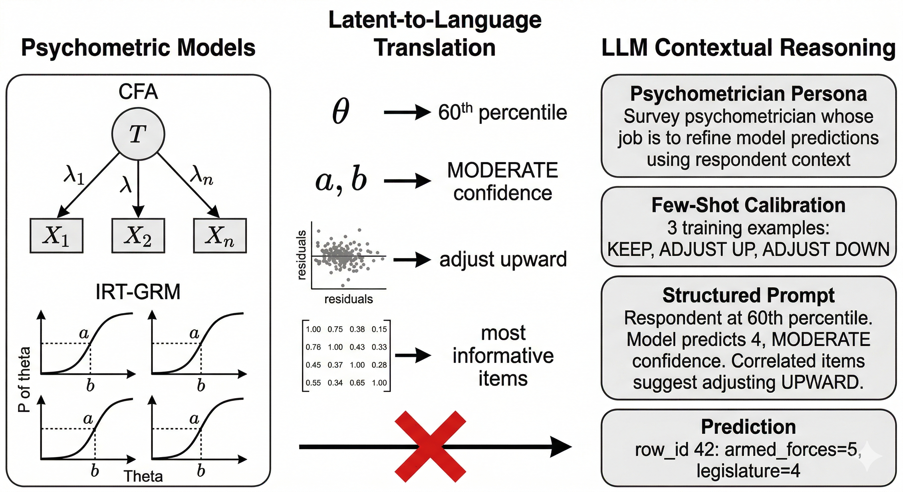
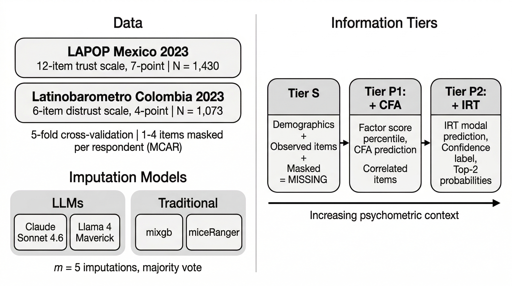

```{r}
#| label: setup
#| include: false

library(viridis)
library(knitr)
library(kableExtra)

set.seed(721)

data_dir <- "D:/repos/UMD_classes_code/TSE_II_SURV721/results"

# ── Load imputation results ──────────────────────────────────
llm_results  <- readRDS(file.path(data_dir, "results_item.rds"))
trad_results <- readRDS(file.path(data_dir,
                                   "results_trad_item.rds"))

# ── Load pre-computed evaluation objects ─────────────────────
load(file.path(data_dir, "evaluation_rq.RData"))

# ── tidyverse loaded last ────────────────────────────────────
library(tidyverse)

# ── Combined results (Gemma dropped) ────────────────────────
shared_cols <- c("survey", "fold_id", "n_masked", "tier",
                 "method", "row_id", "item", "actual",
                 "predicted", "cfa_baseline", "irt_baseline")

all_results <- bind_rows(
  trad_results |> filter(!is.na(predicted)) |>
    select(all_of(shared_cols)) |>
    mutate(method_type = "Traditional"),
  llm_results |> filter(!is.na(predicted)) |>
    select(all_of(shared_cols)) |>
    mutate(method_type = "LLM")
) |>
  filter(method != "gemma3_27b") |>
  mutate(
    method_label = recode(method,
      llama4_maverick = "Maverick",
      claude_sonnet   = "Claude Sonnet",
      mixgb           = "mixgb",
      miceRanger      = "miceRanger"),
    method_type = factor(method_type,
                         levels = c("Traditional", "LLM")),
    tier = factor(tier, levels = c("S", "P1", "P2")),
    survey_label = if_else(survey == "lapop",
                           "LAPOP Mexico",
                           "Latinobarómetro Colombia")
  )

# ── Recompute Biemer decompositions with population variance ─
compute_biemer <- function(delta_col, config_label) {
  rq3_delta_a |>
    group_by(survey_label, item) |>
    summarise(
      gold_a   = round(mean(Gold), 3),
      bias     = round(mean(.data[[delta_col]]), 4),
      bias_sq  = mean(.data[[delta_col]])^2,
      variance = sum((.data[[delta_col]] - mean(.data[[delta_col]]))^2) / n(),
      mse      = mean(.data[[delta_col]]^2),
      pct_syst = round(
        if_else(mean(.data[[delta_col]]^2) > 0,
                mean(.data[[delta_col]])^2 / mean(.data[[delta_col]]^2) * 100,
                0), 1),
      .groups  = "drop"
    ) |>
    mutate(config = config_label)
}

rq3_biemer_claude <- compute_biemer("delta_claude", "Claude P2")
rq3_biemer_mixgb  <- compute_biemer("delta_mixgb",  "mixgb S")
```

## The Problem

\vspace{0.4cm}

\large

When respondents skip items within a psychometric scale, the latent score cannot be computed without imputation.

\vspace{0.3cm}

Traditional methods impute from observed correlations, but they never see the measurement model that defines the construct.

\vspace{0.3cm}

LLMs can reason over text, but they need to be told what the psychometric model found.

\vspace{0.6cm}

\centering
\Large

\textbf{What if we translated psychometric model conclusions into natural language prompts?}

\normalsize

## The L2L Framework

{fig-align="center" width="518"}

## Experimental Conditions

{fig-align="center" width="535"}

## RQ1: Item-Level Measurement Error

::::: columns
::: {.column width="35%"}
\vspace{0.3cm}

\footnotesize

**Does richer psychometric context reduce prediction error?**

\vspace{0.2cm}

$$W\kappa = 1 - \frac{\sum w_{ij} O_{ij}}{\sum w_{ij} E_{ij}}$$

Quadratic weights $w_{ij} = \frac{(i-j)^2}{(K-1)^2}$

$W\kappa = 1$: perfect agreement

\vspace{0.4cm}

Claude S $\rightarrow$ P1 $\rightarrow$ P2:

.645 $\rightarrow$ .667 $\rightarrow$ .675

\vspace{0.1cm}

Claude outperforms mixgb (.615) and miceRanger (.561) at tier S

\normalsize
:::

::: {.column width="65%"}
```{r}
#| fig-width: 7
#| fig-height: 4.5

ggplot(rq1_item_summary |> 
         filter(method_type == "LLM",
                survey_label == "LAPOP Mexico"),
       aes(x = tier, y = wkappa,
           color = method_label,
           group = method_label)) +
  geom_line(data = function(d) filter(d, !method_label %in% c("Claude Sonnet", "mixgb")),
            linewidth = 1, alpha = 0.5) +
  geom_point(data = function(d) filter(d, !method_label %in% c("Claude Sonnet", "mixgb")),
             size = 2.5, alpha = 0.5) +
  geom_line(data = function(d) filter(d, method_label == "Claude Sonnet"),
            linewidth = 1.2) +
  geom_point(data = function(d) filter(d, method_label == "Claude Sonnet"),
             size = 3) +
  geom_hline(data = rq1_item_summary |>
               filter(method_type == "Traditional", tier == "S",
                      survey_label == "LAPOP Mexico"),
             aes(yintercept = wkappa,
                 color = method_label),
             linetype = "dashed", linewidth = 1) +
  scale_color_viridis_d(option = "D", end = 0.85) +
  labs(x = "Information Tier",
       y = "Weighted Kappa",
       color = "Method") +
  theme_minimal(base_size = 13) +
  theme(
    strip.text = element_text(face = "bold", size = 12),
    legend.position = "bottom",
    panel.grid.minor = element_blank()
  )
```
:::
:::::

## RQ2: Person-Level Measurement Error

::::: columns
::: {.column width="35%"}
\vspace{0.3cm}

\footnotesize

**Do imputed data preserve respondents' latent scores?**

\vspace{0.2cm}

$$\theta_{\text{imp}} = \beta_0 + \beta_1 \theta_{\text{gold}} + \varepsilon$$

$\beta_1$: scale fidelity

$\beta_1 = 1.0$: preserved \| $< 1.0$: compression

\vspace{0.4cm}

Claude P2 slope = 1.03

mixgb S slope = 1.01

\vspace{0.1cm}

\normalsize
:::

::: {.column width="65%"}
```{r}
#| fig-width: 7
#| fig-height: 4.5

scatter_data <- rq2_person |>
  filter(survey_label == "LAPOP Mexico",
         (method == "claude_sonnet" & tier == "P2") |
         (method == "mixgb" & tier == "S")) |>
  mutate(label = paste(method_label,
                        if_else(method_type == "LLM",
                                "(P2)", "(S)")))

slope_labels <- scatter_data |>
  group_by(label) |>
  summarise(
    slope = round(coef(lm(theta_imp ~ theta_gold))[2], 2),
    r_val = round(cor(theta_gold, theta_imp), 3),
    .groups = "drop"
  ) |>
  mutate(annot = paste0("slope = ", slope,
                         "  |  r = ", r_val))

ggplot(scatter_data,
       aes(x = theta_gold, y = theta_imp)) +
  geom_abline(slope = 1, intercept = 0,
              linetype = "dashed", color = "grey50",
              linewidth = 0.5) +
  geom_point(alpha = 0.2, size = 0.8,
             color = viridis(3)[2]) +
  geom_smooth(method = "lm", se = FALSE,
              color = viridis(3)[1],
              linewidth = 1) +
  geom_text(data = slope_labels,
            aes(x = -Inf, y = Inf, label = annot),
            hjust = -0.05, vjust = 1.5,
            size = 4, color = "grey20",
            inherit.aes = FALSE) +
  facet_wrap(~ label, ncol = 1) +
  labs(x = expression(theta[ground~truth]),
       y = expression(theta[imputed])) +
  theme_minimal(base_size = 13) +
  theme(strip.text = element_text(face = "bold", size = 12),
        panel.grid.minor = element_blank())
```
:::
:::::

## RQ3: Instrument-Level Measurement Error

::::: columns
::: {.column width="35%"}
\vspace{0.3cm}

\footnotesize

**Does imputation distort the measurement model's psychometric properties?**

\vspace{0.2cm}

$$\text{MSE}_j = \overline{\Delta a_j}^{\,2} + \overline{(\Delta a_j - \overline{\Delta a_j})^2}$$

$\Delta a_{jk} = a_{jk}^{\text{imp}} - a_{jk}^{\text{gold}}$

\vspace{0.1cm}

High Bias$^2$/MSE: systematic

Low ratio: random noise

\vspace{0.4cm}

Claude P2: 89% systematic

mixgb S: 75%

\vspace{0.1cm}

Both inflate discrimination, but the error breaks down differently

\normalsize
:::

::: {.column width="65%"}
```{r}
#| fig-width: 7
#| fig-height: 4.5

biemer_both <- rq3_delta_a |>
  filter(survey_label == "LAPOP Mexico") |>
  pivot_longer(cols = c(delta_claude, delta_mixgb),
               names_to = "config",
               values_to = "delta") |>
  mutate(config = recode(config,
    delta_claude = "Claude P2",
    delta_mixgb  = "mixgb S")) |>
  group_by(survey_label, item, config) |>
  summarise(
    bias_sq  = mean(delta)^2,
    variance = sum((delta - mean(delta))^2) / n(),
    mse      = mean(delta^2),
    pct_syst = round(
      if_else(mean(delta^2) > 0,
              mean(delta)^2 / mean(delta^2) * 100, 0), 0),
    .groups  = "drop"
  )

item_order <- rq3_delta_a |>
  filter(survey_label == "LAPOP Mexico") |>
  group_by(item) |>
  summarise(gold_a = mean(Gold), .groups = "drop")

biemer_both <- biemer_both |>
  left_join(item_order, by = "item") |>
  mutate(
    config = factor(config, levels = c("mixgb S", "Claude P2"))
  )

ggplot(biemer_both,
       aes(x = config,
           y = reorder(item, gold_a),
           fill = mse)) +
  geom_tile(color = "white", linewidth = 0.5) +
  geom_text(aes(label = paste0(pct_syst, "%")),
            size = 5, color = "black",
            fontface = "bold") +
  scale_fill_viridis_c(option = "F", begin = 0.15, end = 0.99,
                        alpha = 0.8, direction = -1, name = "MSE") +
  labs(x = NULL, y = NULL,
       caption = "Labels: % of MSE attributable to Bias\u00b2") +
  theme_minimal(base_size = 13) +
  theme(
    panel.grid = element_blank(),
    legend.position = "bottom",
    axis.text.x = element_text(face = "bold", size = 12),
    axis.text.y = element_text(size = 11)
  )
```
:::
:::::

## Recommendations and Future Directions

\vspace{0.3cm}

::::: columns
::: {.column width="50%"}
\centering

\textbf{For Survey Methodologists}

\vspace{0.3cm}

\large

\textbf{1.} Check for LLM world-knowledge bias at the item level before deploying

\vspace{0.25cm}

\textbf{2.} Less is more: softer psychometric anchors can outperform detailed ones

\vspace{0.25cm}

\textbf{3.} LLM error is predictable; tree-based error is mixed. Choose based on your analysis goals.

\normalsize
:::

::: {.column width="50%"}
\centering

\textbf{Future Directions}

\vspace{0.3cm}

\large

\textbf{1.} Combine LLM and tree-based imputations through model stacking

\vspace{0.25cm}

\textbf{2.} Test how prompt specificity interacts with scale length and newer LLMs

\vspace{0.25cm}

\textbf{3.} Extend to realistic missing data patterns and other constructs

\normalsize
:::
:::::

\vspace{0.5cm}
\centering

\small klinares\@umd.edu
